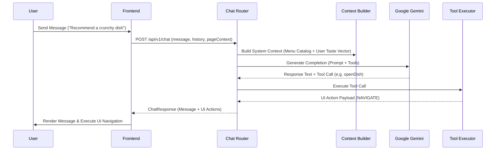

<div align="center">

# 🍽️ TasteAI — Personalized AI Dining Discovery

[](https://www.python.org/)
[](https://fastapi.tiangolo.com/)
[](https://react.dev/)
[](https://www.typescriptlang.org/)
[](https://vitejs.dev/)
[](LICENSE)

*An intelligent dining discovery monorepo platform that combines an **8-dimensional deterministic vector recommendation engine** with a context-aware **AI Dining Waiter powered by Google Gemini**.*

[Features](#-features) • [Tech Stack](#-tech-stack) • [Folder Structure](#-folder-structure) • [Installation](#-installation) • [AI Architecture](#-ai-architecture) • [API Overview](#-api-overview) • [Contributing](CONTRIBUTING.md)

</div>

---

## 📖 Project Overview

Traditional restaurant menus present static lists of dishes without accounting for an individual diner's unique taste preferences (e.g., spice tolerance, sweet tooth, crunch preference, or adventurousness).

**TasteAI** solves this by capturing a diner's **Taste Identity** through a quick 8-question quiz, constructing an **8-dimensional preference vector**. The backend recommendation service computes mathematical vector distances against the restaurant's menu catalog to deliver **instant, highly relevant, and explainable recommendations**.

Additionally, diners can converse with an **AI Dining Assistant** built on Google Gemini that understands their profile, current page context, and cart items, offering dish recommendations and dynamically navigating the UI. If offline, the app falls back to a deterministic offline `LocalRecommendationEngine` using the cached Taste Passport.

---

## ✨ Features

- **🎯 8-Dimensional Taste Identity Vector**: Quantifies preferences across `Spice`, `Sweetness`, `Creaminess`, `Tanginess`, `Smokiness`, `Crunch`, `Adventure`, and `Portion`.
- **⚡ Deterministic Recommendation Engine**: Uses weighted Euclidean distance & cosine similarity to rank dishes objectively without relying on LLM math.
- **🤖 AI Dining Waiter (Google Gemini)**: Conversational assistant capable of answering dish queries and dispatching interactive UI actions (`NAVIGATE`, `HIGHLIGHT_DISH`, `ADD_TO_CART`).
- **📱 High-Density Desktop Menu**: Clean responsive grid scaling up to **7 items per row** on desktop viewports.
- **📖 Deep Dish Transparency**: Displays ingredients in wrapped pill badges, allergen warnings, dietary badges, chef's notes, and dish flavor vector progress bars.
- **Simulated Marketplace**: Includes a marketplace sandbox tab to demonstrate partner integration logic without actual Swiggy/Zomato dependencies.

---

## 🖼️ Screenshots

<div align="center">

| Landing & Taste Quiz | Restaurant Menu (7-Column Grid) |
| :---: | :---: |
| *(Placeholder: Taste Identity Quiz)* | *(Placeholder: 7-Column Desktop Menu Grid)* |

| Dish Flavor Profile | AI Dining Assistant |
| :---: | :---: |
| *(Placeholder: 8-Dimensional Flavor Bars)* | *(Placeholder: Floating AI Chat Window)* |

</div>

---

## 🛠️ Tech Stack

### Backend
- **Framework**: FastAPI (Python 3.11+)
- **ORM & Database**: SQLAlchemy (SQLite for dev / PostgreSQL for prod)
- **Validation**: Pydantic v2 & Pydantic-Settings
- **LLM Integration**: Google Gemini API via OpenAI client compatibility interface
- **Testing**: Pytest & `pytest-asyncio`

### Frontend (Android App via Capacitor)
- **Framework**: React 19 + Vite 8 + TypeScript 5
- **Styling**: Tailwind CSS v4 (Custom dark mode palette `#0A0A0A` / `#171717` / `#F97316`)
- **State & Async**: React Context API & TanStack React Query v5
- **Icons**: Lucide React
- **Mobile**: Capacitor core & android for native compilation
- **Icons**: Lucide React

---

## 📁 Folder Structure

```
innova_hack/
├── docs/                       # Project Documentation Suite
│   ├── architecture.md         # Full System Architecture
│   ├── api.md                  # REST API Reference
│   ├── database.md             # ER Diagrams & Schema Specs
│   ├── setup.md                # Installation & Environment Guide
│   ├── roadmap.md              # Milestones & Roadmap
│   └── tasks.md                # Task Execution & Test Log
├── backend/                    # FastAPI Backend Application
│   ├── app/
│   │   ├── main.py             # FastAPI App Entrypoint
│   │   ├── config/             # Environment & Logging Configuration
│   │   ├── middleware/         # Exception Handlers & Response Envelopes
│   │   ├── database/           # SQLAlchemy Session & Engine
│   │   ├── models/             # Database Models
│   │   ├── schemas/            # Pydantic Validation Schemas
│   │   ├── routes/             # REST Endpoint Handlers
│   │   ├── controllers/        # Request Controllers
│   │   ├── services/           # Recommendation Engine & Taste Logic
│   │   ├── ai/                 # Gemini Provider & Prompt Engine
│   │   ├── ingestion/          # Database Seeder Scripts
│   │   └── utils/              # Common Utilities
│   ├── tests/                  # Pytest Unit & Integration Suite
│   └── requirements.txt        # Python Dependencies
├── frontend/                   # React 18 + Vite Frontend Monorepo
│   ├── src/
│   │   ├── main.tsx            # Vite Entrypoint
│   │   ├── App.tsx             # Root Component
│   │   ├── router.tsx          # React Router
│   │   ├── pages/              # View Views (Landing, Quiz, Restaurant, DishDetail, Profile, Cart)
│   │   ├── components/         # Reusable Components
│   │   ├── layouts/            # Page Layouts
│   │   ├── hooks/              # Custom Hooks & React Contexts
│   │   ├── services/           # Axios Client, React Query, Types
│   │   └── styles/             # Tailwind CSS & Global Stylesheets
│   └── package.json            # Node Dependencies
├── CONTRIBUTING.md             # Team Collaboration Guide
├── README.md                   # Open Source Overview
└── .editorconfig               # Code Formatting Standard
```

---

## ⚙️ Environment Variables

### Backend Configuration (`backend/.env`)
Create `backend/.env` (reference `backend/.env.example`):
```env
PROJECT_NAME=TasteAI
API_V1_STR=/api/v1
DATABASE_URL=sqlite:///./tasteai.db
BACKEND_CORS_ORIGINS=["http://localhost:5173","http://localhost:3000"]
GEMINI_API_KEY=your_google_gemini_api_key_here
```

### Frontend Configuration (`frontend/.env`)
Create `frontend/.env`:
```env
VITE_API_BASE_URL=http://localhost:8001/api/v1
```

---

## 🚀 Installation & Running Locally

### 1. Prerequisites
Ensure you have installed:
- **Python**: v3.11 or higher
- **Node.js**: v18.0.0 or higher
- **npm**: v9.0.0 or higher

---

### 2. Backend Setup & Startup

```bash
# 1. Navigate to backend
cd backend

# 2. Create and activate virtual environment
python -m venv .venv
# On Windows (PowerShell):
.\.venv\Scripts\Activate.ps1
# On Linux/macOS:
# source .venv/bin/activate

# 3. Install dependencies
pip install -r requirements.txt

# 4. Seed database with menu & dish vectors
python -m app.ingestion.seed_data

# 5. Start Uvicorn backend server on port 8001
$env:PYTHONPATH = "."
python -m uvicorn app.main:app --host 0.0.0.0 --port 8001
```

---

### 3. Frontend Setup & Startup

```bash
# 1. Open a new terminal and navigate to frontend
cd frontend

# 2. Install dependencies
npm install

# 3. Start Vite dev server on port 5173
npm run dev
```

Visit **`http://localhost:5173`** in your browser.

---

### 4. Android Build (APK)

TasteAI compiles to a native Android app using Capacitor.

```bash
# From the frontend directory
npm run build
npx cap sync android
cd android
./gradlew assembleDebug
```
The resulting APK will be in `frontend/android/app/build/outputs/apk/debug/app-debug.apk`.

---

## 🤖 AI Architecture



---

## 🌐 API Overview

| Method | Endpoint | Description |
| :--- | :--- | :--- |
| `GET` | `/health` | System health status |
| `GET` | `/api/v1/restaurant` | Primary restaurant metadata |
| `GET` | `/api/v1/categories` | Menu categories sorted by display order |
| `GET` | `/api/v1/dishes` | All menu items (supports `?category_id=`) |
| `GET` | `/api/v1/dish/{id}` | Detailed dish info, ingredients & flavor vectors |
| `POST` | `/api/v1/users` | Creates guest user session |
| `POST` | `/api/v1/taste-profile` | Submits quiz answers & calculates 8D vector |
| `GET` | `/api/v1/taste-profile/{user_id}` | Fetches user's Taste Identity vector |
| `GET` | `/api/v1/recommendations/{user_id}` | Calculates match scores & recommendation reasons |
| `POST` | `/api/v1/chat` | AI Dining Assistant completion & tool dispatcher |

For detailed request/response schemas, view **[`docs/api.md`](docs/api.md)**.

---

## 🐳 Deployment

TasteAI includes Docker configuration for containerized deployment:

```bash
# Build & run backend container
cd backend
docker build -t tasteai-backend .
docker run -d -p 8001:8001 --env-file .env tasteai-backend

# Build & run frontend container
cd frontend
docker build -t tasteai-frontend .
docker run -d -p 5173:80 tasteai-frontend
```

---

## 🔮 Future Improvements

- [ ] **Collaborative Filtering ML Models**: Hybrid recommendation blending vector distance with matrix factorization.
- [ ] **Multi-Tenant Support**: Multi-restaurant support with tenant-isolated database schemas.
- [ ] **Kitchen Display System (KDS)**: Real-time order status tracking over WebSockets.
- [ ] **Offline PWA Support**: Service worker caching for offline menu browsing.

---

## 👥 Team & Collaboration

TasteAI is developed and maintained by a team of four:

- **Ananthasail18** ([@ananthasail18](https://github.com/ananthasail18)) — Lead Architect & Developer

For guidelines on branch management (`develop`, `feature/frontend`, `feature/backend`, `feature/ai`, `feature/data`), code reviews, and opening pull requests, please read our **[CONTRIBUTING.md](CONTRIBUTING.md)**.

---

## 📄 License

This project is licensed under the MIT License — see the [LICENSE](LICENSE) file for details.
