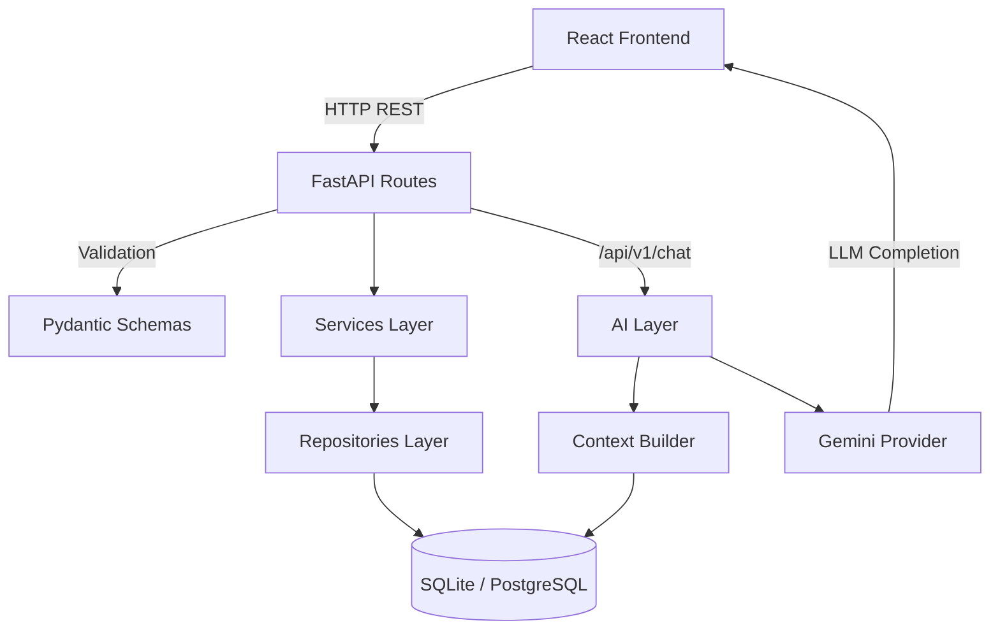
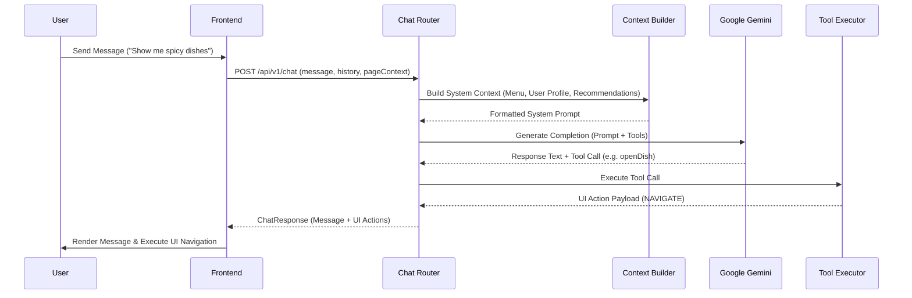

# TasteAI System Architecture

## Overview
**TasteAI** is a personalized dining discovery platform that combines a **deterministic vector recommendation engine** with an **AI Dining Assistant powered by Google Gemini**. 

The system enforces a strict architectural boundary:
- **Business Logic & Vector Calculations**: 100% deterministic backend calculation (Euclidean distance & cosine similarity).
- **AI Dining Assistant**: Context-aware conversational agent responsible for explanation, guidance, and interactive assistant capabilities without performing recommendations itself.

---

## Monorepo Directory Structure

```
innova_hack/
├── docs/                       # Project documentation
├── backend/                    # FastAPI Backend Application
│   ├── app/
│   │   ├── main.py             # FastAPI App Entrypoint
│   │   ├── config/             # App & Logging Configuration
│   │   ├── middleware/         # Exception Handlers & Response Envelopes
│   │   ├── database/           # SQLAlchemy Session & Engine
│   │   ├── models/             # Database Models
│   │   ├── schemas/            # Pydantic Schemas
│   │   ├── routes/             # API Endpoints
│   │   ├── controllers/        # Request Processing Controllers
│   │   ├── services/           # Recommendation & Taste Identity Services
│   │   ├── ai/                 # AI Engine & Vector Store
│   │   │   ├── recommendation/ # Similarity & Ranking Algorithms
│   │   │   ├── embeddings/     # Vector Space Operations
│   │   │   ├── vector_store/   # Vector Storage Operations
│   │   │   └── prompts/        # Gemini Provider, Context Builder & Tool Executors
│   │   ├── ingestion/          # Data Seeding Scripts
│   │   └── utils/              # Helper Utilities
│   └── tests/                  # Pytest Unit & Integration Tests
└── frontend/                   # React 18 + Vite Frontend Application
    ├── src/
    │   ├── main.tsx            # Vite Entrypoint
    │   ├── App.tsx             # Root Application Component
    │   ├── router.tsx          # React Router Configuration
    │   ├── pages/              # View Pages (Landing, Quiz, Restaurant, DishDetail, Profile, Cart)
    │   ├── components/         # Reusable UI & Feature Components
    │   ├── layouts/            # Page Layout Templates
    │   ├── hooks/              # Context Providers & Custom Hooks
    │   ├── services/           # Axios Client, React Query Hooks, TypeScript Types, LocalRecommendationEngine
    │   ├── utils/              # Helper Utilities
    │   └── styles/             # Tailwind CSS & Global Stylesheets
    └── capacitor.config.ts     # Capacitor configuration
```

---

## Backend Architecture

The backend follows a layered architectural pattern:
1. **Route Layer (`app/routes/`)**: Handles HTTP requests, input validation via Pydantic schemas, and response formatting using standard envelopes.
2. **Service Layer (`app/services/`)**: Implements pure business logic, including the 8-dimensional Taste Identity algorithm and vector similarity computations.
3. **Repository Layer (`app/repositories/`)**: Encapsulates database queries using SQLAlchemy ORM.
4. **AI Layer (`app/ai/prompts/`)**: Manages context construction, system prompt generation, and Google Gemini API integration.



---

## Frontend Architecture (Android App via Capacitor)

The frontend is built with React 19, Vite 8, and TypeScript using a modular layer pattern compiled to Android via Capacitor:
- **State Management**: React Context API (`CartContext`, `SessionContext`, `ThemeContext`) for local state and TanStack React Query for async server state.
- **Offline Resilience**: `LocalRecommendationEngine` provides a deterministic fallback when offline, utilizing the cached Taste Passport.
- **Styling System**: Tailwind CSS v4 configured with a custom dark theme (`#0A0A0A` background, `#171717` cards, `#F97316` primary accents).
- **Responsive Layout**: High-density grid component (`DishGrid`) scaling up to **7 columns per row** (`2xl:grid-cols-7`) on desktop viewports.

---

## AI Pipeline Architecture

The AI Dining Assistant pipeline operates in 5 stages:



1. **Context Assembly**: `ContextBuilder` fetches menu items, user taste profile, and top recommendations.
2. **Prompt Generation**: `PromptBuilder` constructs system instructions prohibiting LLM vector calculations and enforcing menu adherence.
3. **LLM Inference**: `GeminiProvider` sends messages to Google Gemini API.
4. **Tool Execution**: `ToolExecutor` validates LLM tool calls (`highlightDish`, `openDish`, `compareDishes`, `addToCart`).
5. **UI Action Dispatch**: Frontend executes returned UI action payloads to dynamically update the interface.
